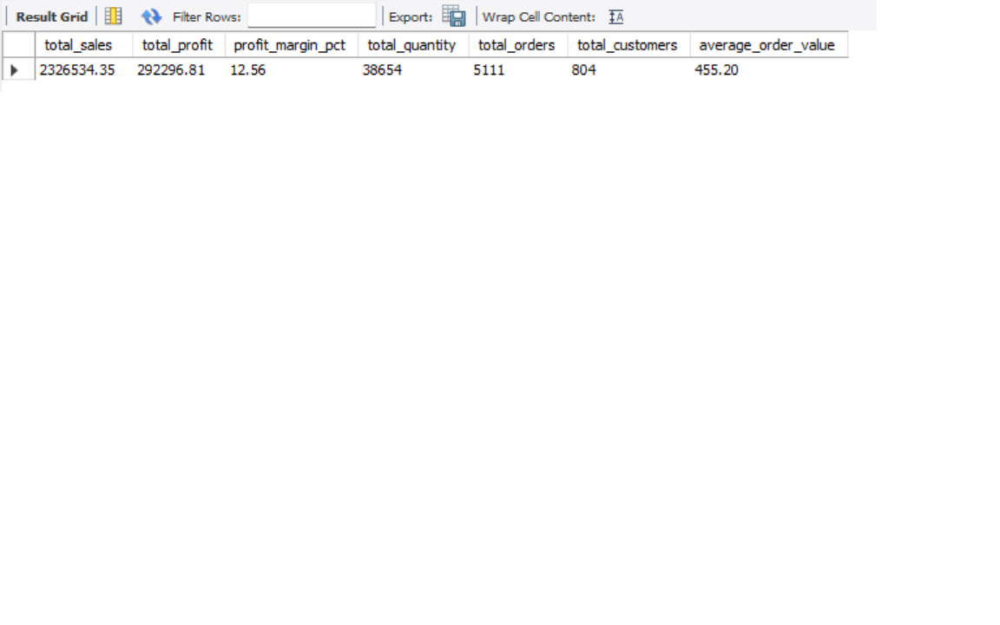
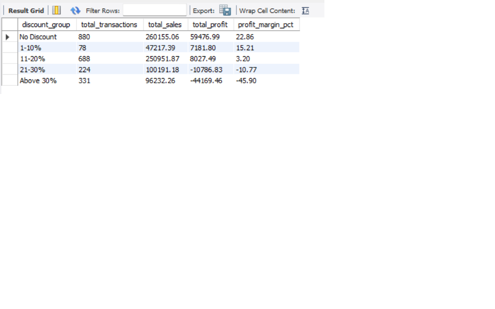
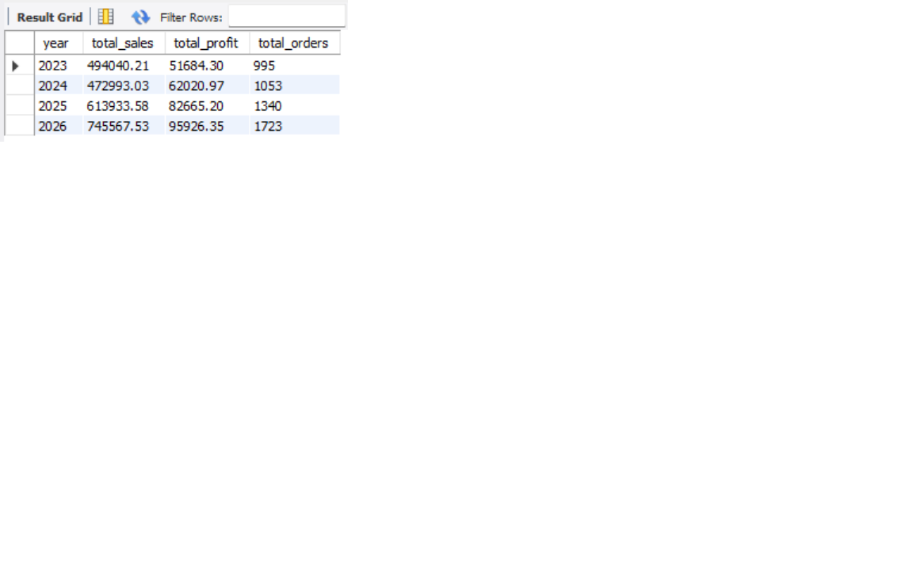
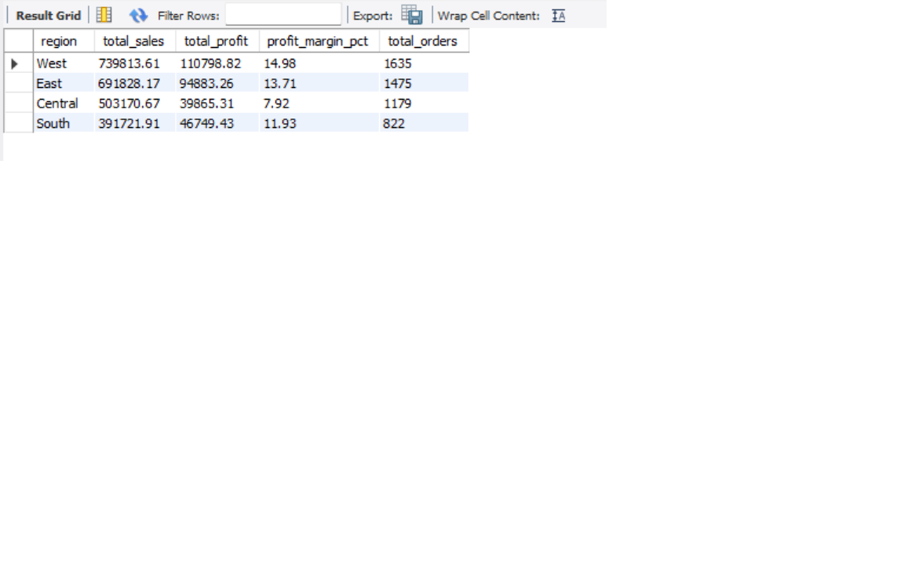
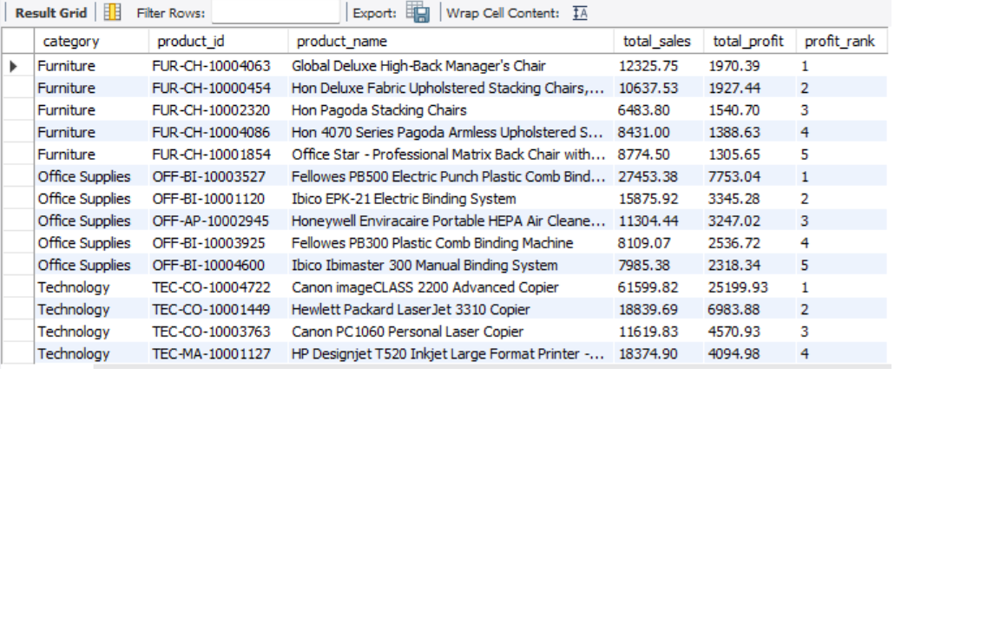

# Superstore Sales Analysis using SQL

## Ringkasan Project

Project ini menganalisis data penjualan **Superstore** menggunakan MySQL untuk mengevaluasi performa Sales, Profit, Customer, Product, Region, Discount, serta tren penjualan dari waktu ke waktu.

Analisis dilakukan terhadap **10.194 baris data transaksi/order line** dari tahun **2023 sampai 2026**, yang terdiri dari **5.111 Order unik** dan **804 Customer unik**.

Project mencakup:

- Data Preparation
- Data Cleaning
- Data Quality Check
- Business KPI Analysis
- Category Analysis
- Discount Analysis
- Regional Analysis
- Customer Analysis
- Product Analysis
- Sales Trend Analysis
- Advanced SQL Analysis

**English Summary:**  
This project analyzes Superstore sales data using MySQL to evaluate sales performance, profitability, customer behavior, product performance, regional performance, discount impact, and sales trends.

---

## Key Findings

- Total Sales mencapai **2,326,534.35** dengan Total Profit sebesar **292,296.81** dan overall Profit Margin **12.56%**.
- **Technology** merupakan Category dengan Profit tertinggi dan Profit Margin sebesar **17.45%**.
- **Furniture** menghasilkan Sales yang tinggi tetapi Profit Margin hanya **2.61%**.
- **Tables** dan **Bookcases** menghasilkan Total Profit negatif.
- Transaksi Furniture dengan Discount di atas **20%** secara agregat menghasilkan Profit Margin negatif.
- **West** merupakan Region dengan performa terbaik berdasarkan Sales, Profit, Profit Margin, dan jumlah Order.
- Customer dengan Sales tertinggi tidak selalu menjadi Customer paling profitable.
- **2026** merupakan tahun dengan Sales, Profit, dan jumlah Order tertinggi.
- Produk dengan Sales tertinggi hanya berkontribusi sekitar **2.65%** terhadap Total Sales, menunjukkan Sales relatif tersebar di banyak produk.

---

## Visual Highlights

### 1. Overall Business KPI



Ringkasan KPI utama mencakup Total Sales, Total Profit, Profit Margin, Total Quantity, Total Orders, Total Customers, dan Average Order Value.

### 2. Furniture Discount Analysis



Transaksi Furniture dengan Discount di atas 20% secara agregat menunjukkan Profit Margin negatif.

### 3. Yearly Sales Performance



Performa meningkat pada 2025 dan 2026, dengan 2026 menghasilkan Sales, Profit, dan jumlah Order tertinggi.

### 4. Regional Performance



West merupakan Region dengan performa terkuat berdasarkan Sales, Profit, Profit Margin, dan Total Orders.

### 5. Advanced SQL Analysis



Product Ranking dilakukan menggunakan SQL Window Function untuk memberikan ranking Product di dalam masing-masing Category.

---


## Tujuan Project

Project ini dibuat untuk menjawab beberapa pertanyaan bisnis:

- Bagaimana performa Sales dan Profit perusahaan secara keseluruhan?
- Category mana yang menghasilkan Sales dan Profit terbesar?
- Mengapa Furniture memiliki Profit Margin yang rendah?
- Bagaimana hubungan antara Discount dan Profitability?
- Region mana yang memiliki performa terbaik?
- Bagaimana performa Customer?
- Siapa Customer dengan Sales tertinggi?
- Siapa Customer dengan Profit tertinggi?
- Product apa yang menghasilkan Sales dan Profit terbesar?
- Product apa yang menghasilkan kerugian terbesar?
- Bagaimana perkembangan Sales dari tahun ke tahun?
- Bagaimana perubahan Sales dari bulan ke bulan?
- Product apa yang memiliki ranking tertinggi di masing-masing Category?
- Seberapa besar kontribusi setiap Product terhadap Total Sales perusahaan?

---

## Dataset

Dataset berasal dari workbook **Sample Superstore**.

Workbook asli memiliki tiga sheet:

```text
Orders
People
Returns
```

Namun, **project ini hanya menggunakan sheet `Orders`**.

Sheet `Orders` dipilih karena berisi data transaksi yang dibutuhkan untuk analisis Sales.

Dataset yang digunakan memiliki:

- **10.194 baris data**
- **5.111 Order unik**
- **804 Customer unik**
- Periode data **2023–2026**

### Scope Dataset

Project ini merupakan **single-table sales analysis**.

Sheet berikut tidak digunakan:

- `People`
- `Returns`

Dengan demikian, project ini tidak mencakup Return Analysis maupun People / Regional Manager Analysis.

Fokus utama project adalah menganalisis performa bisnis berdasarkan data transaksi pada sheet `Orders`.

### Kolom Utama

Beberapa kolom utama yang digunakan:

- Row ID
- Order ID
- Order Date
- Ship Date
- Ship Mode
- Customer ID
- Customer Name
- Segment
- Country/Region
- City
- State/Province
- Postal Code
- Region
- Product ID
- Category
- Sub-Category
- Product Name
- Sales
- Quantity
- Discount
- Profit

---

## Tools yang Digunakan

- MySQL 8.0
- MySQL Workbench
- Microsoft Excel
- Visual Studio Code
- SQL

---

## Data Preparation

Dataset awal berasal dari sheet:

`Orders`

pada workbook Sample Superstore.

Sheet Orders kemudian disimpan menjadi:

`orders.csv`

File CSV kemudian di-import ke MySQL sebagai tabel:

`orders_raw`

> Petunjuk lengkap proses import dapat dilihat di:
> [`00_import_instructions.md`](00_import_instructions.md)

Tabel raw dipertahankan agar data asli tetap tersedia dan tidak langsung dimodifikasi.

Setelah Data Cleaning, dibuat tabel:

`orders_clean`

Seluruh Business Analysis dilakukan menggunakan tabel `orders_clean`.

### Alur Data

```text
Sample Superstore Workbook
          ↓
      Orders Sheet
          ↓
      orders.csv
          ↓
      orders_raw
          ↓
     Data Cleaning
          ↓
      orders_clean
          ↓
   Business Analysis
```

---

## Data Cleaning

Proses Data Cleaning dilakukan menggunakan SQL.

### 1. Standardisasi Nama Kolom

Nama kolom diubah menjadi format yang lebih mudah digunakan dalam SQL.

```text
Order ID        → order_id
Order Date      → order_date
Ship Date       → ship_date
Customer ID     → customer_id
Customer Name   → customer_name
Postal Code     → postal_code
Product ID      → product_id
Sub-Category    → sub_category
Product Name    → product_name
```

### 2. Konversi Tanggal

`Order Date` dan `Ship Date` awalnya tersimpan sebagai text.

Keduanya dikonversi menjadi tipe `DATE` menggunakan:

```sql
STR_TO_DATE()
```

### 3. Konversi Data Numerik

Kolom berikut awalnya tersimpan sebagai text:

- Sales
- Discount
- Profit

Data dikonversi menggunakan:

```sql
REPLACE()
CAST()
```

Tipe data akhirnya:

```text
sales     → DECIMAL(12,4)
discount  → DECIMAL(5,4)
profit    → DECIMAL(12,4)
quantity  → INT
```

### 4. Postal Code

Postal Code tidak selalu terdiri dari angka.

Contohnya:

```text
M7A
```

Karena itu Postal Code disimpan sebagai:

```text
VARCHAR(20)
```

dan bukan sebagai integer.

---

## Data Quality Check

Sebelum Business Analysis dilakukan, dataset diperiksa untuk memastikan kualitas data.

Pengecekan meliputi:

- Missing Values
- Duplicate Row ID
- Invalid Shipping Date
- Sales Range
- Quantity Range
- Discount Range
- Profit Range

### Hasil Data Quality Check

| Check | Hasil |
|---|---:|
| Total Rows | 10.194 |
| Missing Values pada kolom penting | 0 |
| Duplicate Row ID | 0 |
| Ship Date sebelum Order Date | 0 |

### Numeric Range

```text
Minimum Sales      : 0.4440
Maximum Sales      : 22,638.4800

Minimum Quantity   : 1
Maximum Quantity   : 14

Minimum Discount   : 0%
Maximum Discount   : 80%

Minimum Profit     : -6,599.9780
Maximum Profit     : 8,399.9760
```

Profit negatif tidak dianggap sebagai data error karena transaksi dapat menghasilkan kerugian.

---

# Business Analysis

## 1. Overall Business KPIs

| KPI | Hasil |
|---|---:|
| Total Sales | 2,326,534.35 |
| Total Profit | 292,296.81 |
| Profit Margin | 12.56% |
| Total Quantity | 38,654 |
| Total Orders | 5,111 |
| Total Customers | 804 |
| Average Order Value | 455.20 |

### Insight

Bisnis menghasilkan lebih dari **2.3 juta Total Sales** dengan Total Profit sekitar **292 ribu**.

Overall Profit Margin sebesar **12.56%**, sedangkan Average Order Value sebesar **455.20**.

Secara keseluruhan bisnis menghasilkan Profit positif.

---

## 2. Category Performance

| Category | Total Sales | Total Profit | Profit Margin |
|---|---:|---:|---:|
| Technology | 839,893.28 | 146,543.38 | 17.45% |
| Furniture | 754,747.76 | 19,730.00 | 2.61% |
| Office Supplies | 731,893.31 | 126,023.44 | 17.22% |

### Insight

**Technology** merupakan Category dengan Sales dan Profit tertinggi serta menghasilkan Profit Margin **17.45%**.

Office Supplies juga memiliki Profit Margin yang kuat sebesar **17.22%**.

Furniture menghasilkan Sales yang relatif tinggi, tetapi Profit Margin hanya **2.61%**.

Hal ini menunjukkan bahwa Category Furniture memiliki masalah profitabilitas meskipun menghasilkan nilai Sales yang cukup besar.

---

## 3. Furniture Profitability Analysis

Untuk mengetahui penyebab rendahnya Profitability Furniture, analisis dilanjutkan pada level Sub-Category.

| Sub-Category | Total Sales | Total Profit | Profit Margin |
|---|---:|---:|---:|
| Tables | 208,020.18 | -17,753.21 | -8.53% |
| Bookcases | 115,361.20 | -3,632.07 | -3.15% |
| Furnishings | 95,598.13 | 13,891.74 | 14.53% |
| Chairs | 335,768.25 | 27,223.53 | 8.11% |

### Insight

Dua Sub-Category menghasilkan Total Profit negatif:

**Tables**

```text
Sales  : 208,020.18
Profit : -17,753.21
Margin : -8.53%
```

**Bookcases**

```text
Sales  : 115,361.20
Profit : -3,632.07
Margin : -3.15%
```

Tables merupakan penyumbang kerugian terbesar pada Category Furniture.

---

## 4. Discount Analysis

Analisis dilanjutkan untuk melihat hubungan antara Discount dan Profitability Furniture.

### Average Discount berdasarkan Sub-Category

| Sub-Category | Average Discount |
|---|---:|
| Tables | 25.81% |
| Bookcases | 21.53% |
| Chairs | 16.92% |
| Furnishings | 13.81% |

Tables dan Bookcases memiliki Average Discount tertinggi sekaligus menghasilkan Total Profit negatif.

### Profitability berdasarkan Discount Group

| Discount Group | Transactions | Total Sales | Total Profit | Profit Margin |
|---|---:|---:|---:|---:|
| No Discount | 880 | 260,155.06 | 59,476.99 | 22.86% |
| 1-10% | 78 | 47,217.39 | 7,181.80 | 15.21% |
| 11-20% | 688 | 250,951.87 | 8,027.49 | 3.20% |
| 21-30% | 224 | 100,191.18 | -10,786.83 | -10.77% |
| Above 30% | 331 | 96,232.26 | -44,169.46 | -45.90% |

### Insight

Profit Margin Furniture cenderung menurun seiring meningkatnya tingkat Discount.

Transaksi tanpa Discount menghasilkan Profit Margin **22.86%**.

Sebaliknya:

- Discount **21–30%** menghasilkan Profit Margin **-10.77%**
- Discount **Above 30%** menghasilkan Profit Margin **-45.90%**

Transaksi Furniture dengan Discount di atas **20%** secara agregat menghasilkan Profit negatif.

Temuan ini menunjukkan adanya hubungan antara tingkat Discount dan Profit Margin, tetapi tidak secara langsung membuktikan hubungan sebab-akibat.

---

## 5. Regional Performance

| Region | Total Sales | Total Profit | Profit Margin | Total Orders |
|---|---:|---:|---:|---:|
| West | 739,813.61 | 110,798.82 | 14.98% | 1,635 |
| East | 691,828.17 | 94,883.26 | 13.71% | 1,475 |
| Central | 503,170.67 | 39,865.31 | 7.92% | 1,179 |
| South | 391,721.91 | 46,749.43 | 11.93% | 822 |

### Insight

**West** merupakan Region dengan performa terbaik berdasarkan:

- Sales
- Profit
- Profit Margin
- Total Orders

Central menghasilkan Sales lebih tinggi daripada South tetapi Profit lebih rendah.

Central juga memiliki Profit Margin terendah sebesar **7.92%**.

Central Region perlu dianalisis lebih lanjut untuk mengidentifikasi faktor yang menyebabkan Profit Margin lebih rendah dibandingkan Region lainnya.

---

## 6. Customer Analysis

Customer dianalisis berdasarkan:

- Total Sales
- Total Profit
- Total Orders

### Customer dengan Sales Tertinggi

**Sean Miller**

```text
Total Sales  : 25,043.05
Total Profit : -1,980.74
Total Orders : 5
```

Walaupun menghasilkan Total Sales tertinggi, Customer tersebut menghasilkan Total Profit negatif.

### Customer dengan Profit Tertinggi

**Tamara Chand**

```text
Total Sales  : 19,052.22
Total Profit : 8,981.32
Total Orders : 5
```

### Insight

Sales yang tinggi tidak selalu menghasilkan Profit yang tinggi.

Performa Customer sebaiknya dievaluasi menggunakan Sales dan Profit secara bersamaan, bukan hanya berdasarkan nilai pembelian.

---

## 7. Product Analysis

Product dianalisis berdasarkan:

- Total Sales
- Total Profit
- Highest Loss

### Product dengan Sales dan Profit Tertinggi

**Canon imageCLASS 2200 Advanced Copier**

```text
Total Sales  : 61,599.82
Total Profit : 25,199.93
```

### Product dengan Kerugian Terbesar

**Cubify CubeX 3D Printer Double Head Print**

```text
Total Sales  : 11,099.96
Total Profit : -8,879.97
```

### Insight

Sales yang tinggi tidak selalu menunjukkan performa Product yang baik.

Profit juga perlu dipertimbangkan untuk menilai Product Performance secara lebih menyeluruh.

---

## 8. Sales Trend Analysis

### Yearly Sales Performance

| Year | Total Sales | Total Profit | Total Orders |
|---|---:|---:|---:|
| 2023 | 494,040.21 | 51,684.30 | 995 |
| 2024 | 472,993.03 | 62,020.97 | 1,053 |
| 2025 | 613,933.58 | 82,665.20 | 1,340 |
| 2026 | 745,567.53 | 95,926.35 | 1,723 |

### Insight

Sales sedikit menurun pada 2024 dibandingkan 2023, tetapi Profit tetap meningkat.

Performa kemudian meningkat pada 2025 dan 2026, baik dari sisi Sales, Profit, maupun jumlah Order.

**2026 merupakan tahun dengan Sales, Profit, dan jumlah Order tertinggi.**

---

## 9. Month-over-Month Growth

Month-over-Month Growth digunakan untuk melihat perubahan Sales dibandingkan bulan sebelumnya.

Perhitungan menggunakan SQL Window Function:

```sql
LAG()
```

Rumus:

```text
(Current Month Sales - Previous Month Sales)
------------------------------------------------ × 100
              Previous Month Sales
```

Nilai positif menunjukkan peningkatan Sales dibandingkan bulan sebelumnya.

Nilai negatif menunjukkan penurunan Sales.

Pertumbuhan tertinggi terjadi pada:

**March 2023**

dengan:

**MoM Growth = 1,159.63%**

Nilai yang sangat tinggi tersebut dipengaruhi oleh Sales February 2023 yang relatif rendah sehingga menghasilkan efek **low base**.

---

## 10. Advanced SQL Analysis

Bagian ini menggunakan beberapa teknik SQL intermediate:

- Common Table Expression (CTE)
- Window Functions
- RANK()
- PARTITION BY
- LAG()
- Running Total
- Cumulative Sales

### Product Ranking Within Each Category

Product diberi ranking berdasarkan Total Sales di masing-masing Category menggunakan:

```sql
RANK() OVER (
    PARTITION BY category
    ORDER BY total_sales DESC
)
```

Dengan cara ini, ranking dimulai kembali untuk setiap Category.

Analisis menghasilkan:

- **Top 5 Products by Sales within each Category**
- **Top 5 Products by Profit within each Category**

### Product Sales Contribution

Product dengan Sales terbesar:

**Canon imageCLASS 2200 Advanced Copier**

memberikan kontribusi sekitar:

**2.65% dari Total Sales perusahaan**

Sedangkan Top 10 Products berdasarkan Sales secara kumulatif berkontribusi sekitar:

**10.51% dari Total Sales**

### Insight

Kontribusi Sales relatif tersebar di banyak Product.

Product dengan Sales tertinggi hanya menyumbang sekitar **2.65%** dari Total Sales, sehingga perusahaan tidak terlalu bergantung pada satu Product sebagai sumber utama Sales.

---

# Business Recommendations

## 1. Evaluasi Strategi Discount Furniture

Strategi Discount Furniture perlu dievaluasi, khususnya pada:

- Tables
- Bookcases

Kedua Sub-Category tersebut menghasilkan Total Profit negatif.

## 2. Evaluasi Discount di Atas 20%

Kelompok transaksi Furniture dengan Discount di atas 20% menghasilkan Profit Margin negatif.

Discount besar sebaiknya diberikan secara lebih selektif dengan mempertimbangkan Profitability.

## 3. Investigasi Tables dan Bookcases

Analisis lebih lanjut dapat dilakukan terhadap:

- Pricing
- Cost Structure
- Discount Strategy
- Product Mix

untuk mengetahui faktor yang menyebabkan kerugian pada Tables dan Bookcases.

## 4. Tingkatkan Profitabilitas Central Region

Central menghasilkan Sales yang cukup besar tetapi hanya memiliki Profit Margin **7.92%**.

Region tersebut perlu dianalisis lebih lanjut untuk mengetahui penyebab rendahnya Profitability.

## 5. Evaluasi Customer Berdasarkan Profitabilitas

Customer dengan Sales tinggi belum tentu menghasilkan Profit tinggi.

Evaluasi Customer sebaiknya menggunakan beberapa metric:

- Sales
- Profit
- Profit Margin
- Order Frequency

## 6. Evaluasi Product yang Menghasilkan Kerugian

Product dengan Sales tinggi tetapi Profit negatif perlu diperiksa lebih lanjut.

Beberapa faktor yang dapat dianalisis:

- Discount
- Pricing
- Cost
- Product Strategy

## 7. Pertahankan Category dengan Performa Kuat

Technology dan Office Supplies memiliki Profitability yang relatif kuat.

Strategi bisnis dapat mempertahankan dan mengembangkan performa kedua Category tersebut.

---

# SQL Skills yang Digunakan

## SQL Fundamentals

```text
SELECT
FROM
WHERE
GROUP BY
ORDER BY
HAVING
LIMIT
```

## Aggregate Functions

```text
SUM()
AVG()
MIN()
MAX()
COUNT()
COUNT(DISTINCT)
```

## Conditional Logic

```text
CASE WHEN
```

## Data Cleaning

```text
CAST()
REPLACE()
STR_TO_DATE()
```

## Date Functions

```text
YEAR()
MONTH()
MONTHNAME()
```

## Advanced SQL

```text
Common Table Expression (CTE)
LAG()
RANK()
PARTITION BY
Window Functions
Running Total
Cumulative Sales
Month-over-Month Growth
```

---

# Struktur Project

```text
Superstore_SQL_Portfolio/
│
├── README.md
├── 00_import_instructions.md
│
├── dataset/
│   └── orders.csv
│
└── sql/
    ├── 01_database_setup.sql
    ├── 02_data_cleaning.sql
    ├── 03_data_quality_check.sql
    ├── 04_kpi_category_analysis.sql
    ├── 05_discount_analysis.sql
    ├── 06_region_analysis.sql
    ├── 07_customer_analysis.sql
    ├── 08_product_analysis.sql
    ├── 09_sales_trend_analysis.sql
    └── 10_advanced_analysis.sql
```

Project memiliki **10 file SQL**.

---

# SQL Files

| File | Fungsi |
|---|---|
| `01_database_setup.sql` | Membuat database, memilih database project, dan mengonfirmasi database aktif |
| `02_data_cleaning.sql` | Membuat `orders_clean`, mengubah tipe data, dan menyiapkan dataset analisis |
| `03_data_quality_check.sql` | Missing Value, Duplicate, Date, dan Numeric Range Validation |
| `04_kpi_category_analysis.sql` | Overall KPI, Category Performance, dan Furniture Analysis |
| `05_discount_analysis.sql` | Average Discount dan Discount vs Profitability Analysis |
| `06_region_analysis.sql` | Regional Sales, Profit, Profit Margin, dan Orders |
| `07_customer_analysis.sql` | Segment dan Customer Performance |
| `08_product_analysis.sql` | Product Sales, Profit, dan Highest Loss |
| `09_sales_trend_analysis.sql` | Yearly Trend, Monthly Trend, dan Month-over-Month Growth |
| `10_advanced_analysis.sql` | Ranking, Window Functions, dan Product Sales Contribution |

---

# Cara Menjalankan Project

## 1. Siapkan MySQL

Gunakan:

- MySQL Server 8.0
- MySQL Workbench

## 2. Buat Database

Jalankan:

`sql/01_database_setup.sql`

Script akan membuat dan memilih database:

`superstore_portfolio`

## 3. Import Dataset

Gunakan:

`dataset/orders.csv`

dan import ke MySQL sebagai tabel:

`orders_raw`

Petunjuk lengkap:

[`00_import_instructions.md`](00_import_instructions.md)

## 4. Jalankan Data Cleaning

Jalankan:

`sql/02_data_cleaning.sql`

Script akan membuat:

`orders_clean`

## 5. Jalankan Data Quality Check

Jalankan:

`sql/03_data_quality_check.sql`

## 6. Jalankan Business Analysis

```text
sql/04_kpi_category_analysis.sql
sql/05_discount_analysis.sql
sql/06_region_analysis.sql
sql/07_customer_analysis.sql
sql/08_product_analysis.sql
sql/09_sales_trend_analysis.sql
sql/10_advanced_analysis.sql
```

---

# Scope dan Limitasi Project

Project ini hanya menggunakan sheet:

`Orders`

Sheet berikut tidak digunakan:

```text
People
Returns
```

Karena itu project belum mencakup:

- Returned Order Analysis
- Return Rate Analysis
- Relationship between Returns and Profit
- People / Regional Manager Analysis
- Multi-table JOIN antara Orders, Returns, dan People

Hal tersebut sengaja berada di luar scope karena project pertama ini difokuskan pada:

**Single-table Sales Analysis menggunakan SQL.**

Multi-table Analysis dan SQL JOIN dapat dikembangkan pada project berikutnya.

---

# Kesimpulan

Secara keseluruhan, bisnis Superstore menghasilkan:

- **Total Sales: 2,326,534.35**
- **Total Profit: 292,296.81**
- **Profit Margin: 12.56%**

Technology dan Office Supplies menunjukkan Profitability yang relatif kuat.

Furniture memiliki Profit Margin yang jauh lebih rendah, terutama karena Tables dan Bookcases menghasilkan Total Profit negatif.

Analisis Discount menunjukkan bahwa transaksi Furniture dengan Discount di atas 20% secara agregat memiliki Profit Margin negatif.

Analisis Customer dan Product juga menunjukkan bahwa Sales yang tinggi tidak selalu menghasilkan Profit yang tinggi.

Dari sisi tren, performa bisnis meningkat kuat pada 2025 dan 2026, dengan 2026 menjadi tahun dengan Sales, Profit, dan jumlah Order tertinggi.

Project ini menunjukkan bagaimana SQL dapat digunakan untuk:

- Menyiapkan data
- Membersihkan data
- Memvalidasi kualitas data
- Menghitung Business KPI
- Menganalisis Profitability
- Menginvestigasi Business Problems
- Menganalisis Customer dan Product
- Menganalisis Sales Trend
- Menggunakan Window Functions
- Menghasilkan Business Insights
- Memberikan Business Recommendations